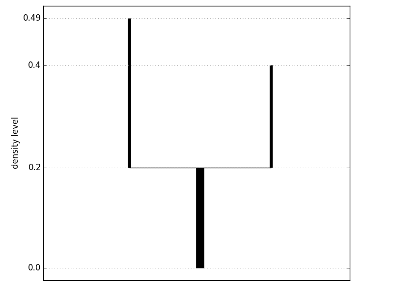
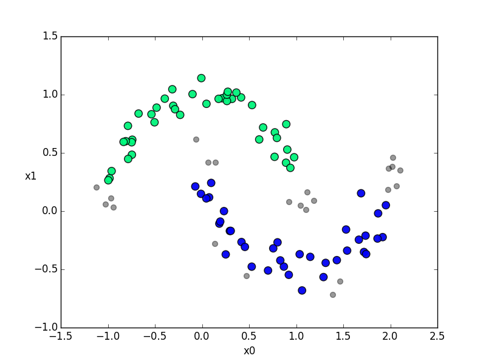

DeBaCl: DEnsity-BAsed CLustering
================================
[](https://travis-ci.org/CoAxLab/DeBaCl)
[](https://github.com/CoAxLab/DeBaCl/pulls)
[](https://github.com/CoAxLab/DeBaCl/issues)
[](http://opensource.org/licenses/BSD-3-Clause)
[](http://debacl.readthedocs.io/en/master/)

DeBaCl is a Python library for **density-based clustering** with **level set trees**.

Level set trees are a statistically-principled way to represent the topology of
a probability density function. This representation is particularly useful for
several core tasks in statistics:

  - clustering, especially for data with multi-scale clustering behavior
  - describing data topology
  - exploratory data analysis
  - data visualization
  - anomaly detection

DeBaCl is a Python implementation of the Level Set Tree method, with an
emphasis on computational speed, algorithmic simplicity, and extensibility.

License
-------
DeBaCl is available under the 3-clause BSD license.

Installation
------------
DeBaCl is currently compatible with Python 2.7 only. Other versions may work, but *caveat emptor*; at this time DeBaCl is only officially tested on Python 2.7. The package can be downloaded and installed from the [Python package installer](https://pypi.python.org/pypi/debacl/). From a terminal:

```bash
$ pip install debacl
```

It can also be installed by cloning this GitHub repo. This requires updating the Python path to include the cloned repo. On linux, this looks something like:

```bash
$ git clone https://github.com/CoAxLab/DeBaCl/
$ export PYTHONPATH='DeBaCl'
```

Dependencies
------------
All of the dependencies are Python packages that can be installed with either conda or pip. DeBaCl 1.0 no longer depends on igraph, which required tricky manual installation.

**Langauges:**
  - Python 2.7
  - (coming soon: Python 3.4)

**Required packages:**
  - numpy
  - networkx
  - prettytable

**Strongly recommended packages**
- matplotlib
- scipy

**Optional packages**
- scikit-learn

Quickstart
----------
<h4>Construct the level set tree</h4>
```python
import debacl as dcl
from sklearn.datasets import make_moons

X = make_moons(n_samples=100, noise=0.1, random_state=19)[0]

tree = dcl.construct_tree(X, k=10, prune_threshold=10)
print tree
```
```no-highlight
+----+-------------+-----------+------------+----------+------+--------+----------+
| id | start_level | end_level | start_mass | end_mass | size | parent | children |
+----+-------------+-----------+------------+----------+------+--------+----------+
| 0  |    0.000    |   0.196   |   0.000    |  0.220   | 100  |  None  |  [1, 2]  |
| 1  |    0.196    |   0.396   |   0.220    |  0.940   |  37  |   0    |    []    |
| 2  |    0.196    |   0.488   |   0.220    |  1.000   |  41  |   0    |    []    |
+----+-------------+-----------+------------+----------+------+--------+----------+
```

<h4>Plot the level set tree</h4>
Clusters are represented by the vertical line segments in the dendrogram. In this example the vertical axis is plotted on the _density_ scale, so that the lower endpoint of a cluster's branch is at its _start_level_ and the upper endpoint is at its _end_level_ (see the table above), and the length of the branch is the _persistence_ of the cluster.
```python
fig = tree.plot(form='density')[0]
fig.show()
```
<!---->


<h4>Query the level set tree for cluster labels</h4>
```python
import matplotlib.pyplot as plt

labels = tree.get_clusters(method='leaf')  # each leaf node is a cluster
clusters = X[labels[:, 0], :]

fig, ax = plt.subplots()
ax.scatter(X[:, 0], X[:, 1], c='black', s=40, alpha=0.4)
ax.scatter(clusters[:, 0], clusters[:, 1], c=labels[:, 1], s=80, alpha=0.9,
           cmap=plt.cm.winter)
ax.set_xlabel('x0')
ax.set_ylabel('x1', rotation=0)
fig.show()
```
<!---->


Documentation
-------------
- [API documentation](http://debacl.readthedocs.io/en/master/)
- [Example jupyter notebooks](examples) (in progress)

Running unit tests
------------------
From the top level of the repo:

```bash
$ nosetests -s -v debacl/test
```

References
----------
- Chaudhuri, K., & Dasgupta, S. (2010). [Rates of Convergence for the Cluster        
  Tree](http://www.cse.ucsd.edu/sites/cse/files/cse/assets/research/theory/ChaudhuriDasgupta_2010.pdf).
  In Advances in Neural Information Processing Systems 23 (pp. 343–351). Vancouver, BC.

- Kent, B. P., Rinaldo, A., Yeh, F.-C., & Verstynen, T. (2014). [Mapping
  Topographic Structure in White Matter Pathways with Level Set 
  Trees](http://journals.plos.org/plosone/article?id=10.1371/journal.pone.0093344#pone-0093344-g009).
  PLoS ONE.

- Kent, B. P., Rinaldo, A., & Verstynen, T. (2013). [DeBaCl: A Python Package
  for Interactive DEnsity-BAsed CLustering](http://arxiv.org/abs/1307.8136).
  arXiv preprint:1307.8136.

- Kent, B.P. (2013). [Level Set Trees for Applied Statistics](http://www.scribd.com/doc/242026196/Level-Set-Trees-for-Applied-Statistics).
